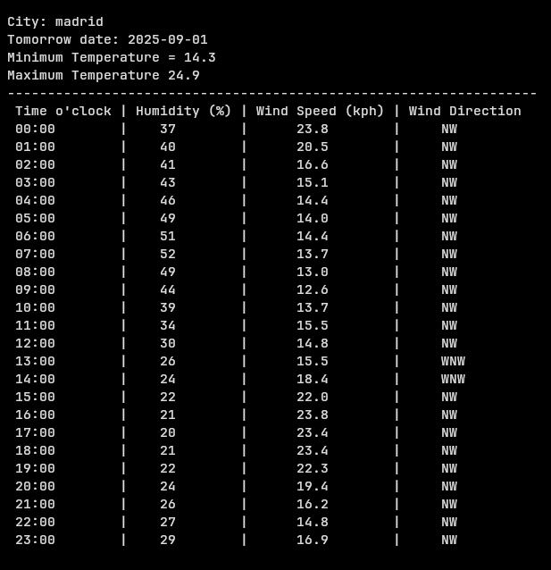

# Work program

Command for run
```
./gradlew clean build run 
```
Out in terminal all data for each cities


# My documentation
---
# Step 0 "Start Project"
#### Create directory

```
mkdir name_project
cd ./name_project
```

### Create data project

```
gradle init --type java-application
```

### Main project

```
cd ./app
sudo rm -rf ./src
mkdir -p src/main/java/com/name_dir
vim src/main/java/com/name_dir/name_app.java
```

### Java code

```java
package com.name_dir;

public class name_app {
    public static void main(String[] args) {
        //your code
        System.out.print("hello");
    }
}
```

### Work with ***gradle**** *

```
vim build.gradle
```

### Gradle('build.gradle')

```gradle
plugins {
    id 'application'
    id 'java'
}

repositories {
    mavenCentral()
}

application {
    mainClass = 'com.dir_name.name_app'
}
```

### Same kotlin/docker build (in my university project I work with kotlin)

```
gradle build
gradle run
```
---
# Step 1 "API Get data"

## Build gradle

```gradle
plugins {
    id 'java'
    id 'application'
}

repositories {
    mavenCentral()
}
//add library for project
dependencies {
    implementation 'com.squareup.okhttp3:okhttp:4.11.0'
    implementation 'com.google.code.gson:gson:2.10.1'
}

application {
    mainClass = 'com.project.App'
}
```

## App.java

```java
package com.project;

import okhttp3.*;
import com.google.gson.*;
import java.io.IOException;

public class App {
    public static void main(String[] args) {
        String url = "http://api.weatherapi.com/v1/current.json?key=d5f374864b0249659a6124128252608&q=London&aqi=no";

        OkHttpClient client = new OkHttpClient();
        Request request = new Request.Builder().url(url).get().build();

        try (Response response = client.newCall(request).execute()) {
            if (!response.isSuccessful()) {
                System.err.println("HTTP error: " + response.code());
                System.err.println(response.body() != null ? response.body().string() : "no body");
                return;
            }
            String body = response.body() != null ? response.body().string() : "{}";
            JsonElement json = JsonParser.parseString(body);
            System.out.println(new GsonBuilder().setPrettyPrinting().create().toJson(json));
        } catch (IOException e) {
            e.printStackTrace();
        }
    }
}
```

---
# Step 2 "Plan work with data"

### Necessary
- [x] get time at the moment, "localtime": (example 2025-08-29)

- [x] search data in "current": "forecast": "forecastday": "date" : "2025-08-30" or "2025-09-01" or "2026-01-01"

- [x] We have place for work. get :

- [x] \- "minterm\_c" :

- [x] \- "maxterm\_c" :

- [x] create table with

- [x] "hour" :

- [x] \- "humidity" :

- [x] \- "wind\_kph" :

- [x] \- "wind\_dir" : (need change name)

### Unnecessary

- [ ] add next day, and add in table data at 00:00(24:00)

- [ ] change all minterm, maxterm
